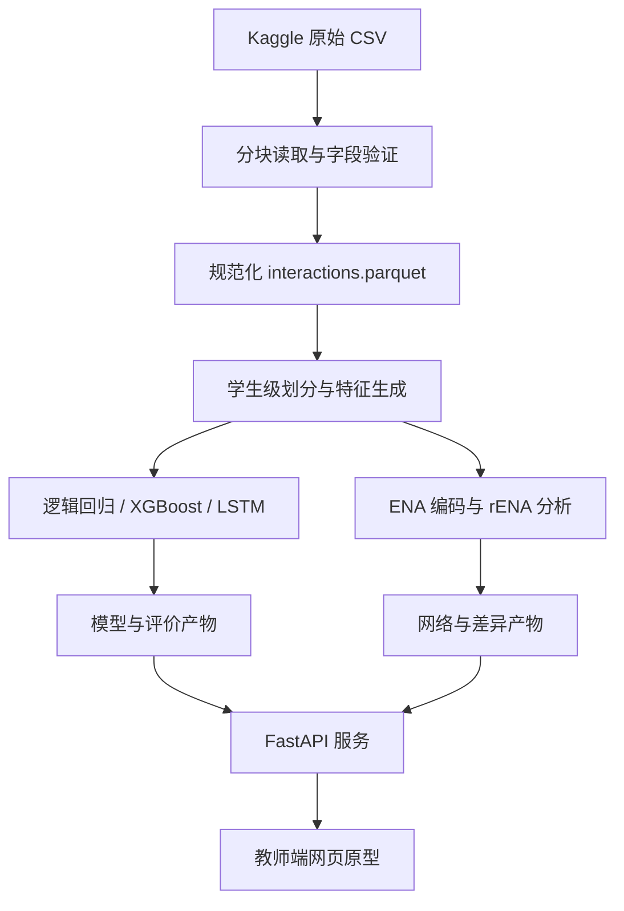

# “知迹”：基于学生答题预测与认知网络分析的学情预警原型系统

> 文档类型：项目方向可行性说明 + 软件开发规格说明  
> 适用对象：指导教师、项目成员、后续代码开发者  
> 文档版本：v1.0  
> 更新日期：2026-09-07  
> 当前阶段：方案设计，实验结果与显著性结论尚未产生

---

## 目录

1. 文档说明与重要更正
2. 项目基本信息
3. 项目要解决的问题
4. 核心思路与使用场景
5. 数据来源与数据字典
6. 研究问题与待检验假设
7. 方法设计及选择理由
8. 预期成果与目标
9. 可行性、难点与风险控制
10. 研究边界与伦理要求
11. 最小可行产品（MVP）范围
12. 系统架构与数据流
13. 技术栈
14. macOS 环境配置
15. 项目目录规范
16. 数据文件与数据契约
17. 数据处理流程
18. 预测任务与特征设计
19. 模型训练与评价
20. ENA 分析设计
21. Python 模块接口
22. HTTP API 接口
23. 命令行接口
24. 教师端页面规格
25. 配置文件规格
26. 模型与分析产物管理
27. 测试方案
28. 开发里程碑
29. 验收标准与继续/停止条件
30. 推荐的实际编码顺序
31. 面向初学者的术语解释
32. 参考资料

---

# 第一部分：项目方向可行性说明

## 1. 文档说明与重要更正

本文件由原 Word 文档《挑战杯_学生答题预测与ENA方向可行性说明》转换、整理并扩展而成。原文中的两个数据截图已改写成可检索的数据字典，便于后续直接写代码。

### 1.1 已确认的数据源

本项目的数据下载入口以以下两个常量为唯一依据：

```python
DATASET_HANDLE = "nicolaswattiez/skillbuilder-data-2009-2010"
DATA_FILE = "2012-2013-data-with-predictions-4-final.csv"
```

需要特别注意：

- Kaggle 数据集句柄中虽然包含 `skillbuilder-data-2009-2010`，但 Kaggle 页面标题及实际主文件指向 **ASSISTments 2012-2013 数据**。
- 实际主文件约 3.01 GB，文件名为 `2012-2013-data-with-predictions-4-final.csv`。
- 实际文件包含 `Average_confidence(FRUSTRATED)`、`Average_confidence(CONFUSED)`、`Average_confidence(CONCENTRATING)`、`Average_confidence(BORED)` 等情感预测字段，因此本项目可以保留“行为 + 情感”的 ENA 设计。
- 代码、配置和论文中必须同时记录“数据集句柄”和“实际文件名”，不能只根据句柄中的年份判断数据内容。

### 1.2 对原文表述的规范化

- 原文中“XGBoost 是简单模型”的说法改为：**XGBoost 是主要表格型基线模型**。它并不算最简单，因此本项目另设“总体正确率基线”和逻辑回归作为检查基线。
- 原文中“ENA 解释预测”的说法改为：**ENA 描述不同学习群体的行为—情感连接模式**。ENA 不能直接证明某种情感导致答错，也不能自动解释某个学生为什么被模型判为高风险。
- 原文中“已完成数据预测”只视为已有探索。只有在代码、数据划分清单、模型文件和评价结果都能重新运行后，才可标记为“已完成可复现实验”。
- 原文编号从“九”跳到“十三”，本版已统一重新编号。

## 2. 项目基本信息

| 项目项 | 内容 |
|---|---|
| 拟定名称 | “知迹”：基于学生答题预测与认知网络分析的学情预警原型系统 |
| 数据来源 | Kaggle 上的 ASSISTments 2012-2013 School Data with Affect 数据副本 |
| Kaggle 句柄 | `nicolaswattiez/skillbuilder-data-2009-2010` |
| 主文件 | `2012-2013-data-with-predictions-4-final.csv` |
| 核心任务 | 预测学生下一次作答正确概率，并分析行为—情感连接模式 |
| 主要方法 | 数据清洗、逻辑回归、XGBoost、LSTM、ENA |
| 展示形式 | 教师端网页原型 + 研究报告 + 可复现实验代码 |
| 拟申报方向 | 科技发明制作 B 类；也可根据最终结果改为自然科学类学术论文 |

## 3. 项目要解决的问题

在线学习平台会留下学生的答题记录，例如答对或答错、提示次数、尝试次数、反应时间、知识点，以及系统预测的困惑、挫败、无聊和专注程度。

教师面对这些日志通常有两类困难：

1. **发现得太晚。**平台往往在学生已经答错以后才反馈，教师难以提前发现下一步可能遇到困难的学生。
2. **只有分数，没有过程。**即使模型给出“下一题答错概率为 70%”，教师仍不知道这名学生近期是否反复使用提示、进行了多次尝试、反应时间异常，或出现了持续困惑等过程模式。

因此，本项目要回答的总问题是：

> 能否利用学生已经发生的答题过程，预测其下一次作答表现，并用行为—情感网络帮助教师理解不同学习群体的过程特征？

项目不是为了自动给学生贴标签，也不是为了替代教师，而是提供一个“提前提醒 + 证据查看 + 人工复核”的原型工具。

## 4. 核心思路与使用场景

### 4.1 答题预测：回答“谁可能在下一次作答中遇到困难”

把同一名学生过去的作答按时间排列，形成学习轨迹。模型使用预测时刻以前的以下信息：

- 历史答题正误；
- 已练习的知识点；
- 提示与最终提示使用情况；
- 尝试次数；
- 首次反应时间和总交互时长；
- 题目类型与学习情境；
- 情感预测值；
- 最近若干题的正确率、提示率、慢反应率等滚动统计。

模型输出：

- 下一次作答正确概率；
- 下一次作答风险概率，即 `1 - 正确概率`；
- 风险等级；
- 支持教师复核的近期行为证据；
- 模型版本和不确定性提示。

### 4.2 ENA：回答“不同学习群体的过程连接有什么差异”

把连续学习过程编码成若干状态，例如：

- 答错；
- 使用提示；
- 使用最底层提示；
- 重复尝试；
- 反应较慢；
- 困惑；
- 挫败；
- 无聊；
- 专注。

ENA 关注的不是某个状态出现了多少次，而是这些状态在相邻学习过程中是否经常共同出现。例如：

- “答错—提示”连接是否较强；
- “困惑—挫败”是否经常一起出现；
- “重复尝试—慢反应”是否形成稳定模式；
- 稳定学习组和持续困难组的平均网络是否不同。

### 4.3 两种方法的分工

| 方法 | 回答的问题 | 不能回答的问题 |
|---|---|---|
| 预测模型 | 下一次作答出现困难的可能性有多大 | 不能单凭概率证明困难原因 |
| 近期证据摘要 | 模型判断前，学生最近发生了什么 | 不能证明这些行为造成了结果 |
| ENA | 不同群体的行为—情感连接结构有何差异 | 不能直接证明因果，也不是个体预测器 |

正确的产品表达应是：“该生近期出现了多次提示与重复尝试；在研究样本中，持续困难组的相关连接更强；请教师结合实际情况复核。”  
不应写成：“困惑导致了该生答错。”

### 4.4 典型使用场景

1. 教师打开班级概览页，查看近期高风险学生。
2. 教师进入某名学生详情页，查看最近 20 次作答及风险变化。
3. 页面展示风险所依据的近期行为事实，例如“最近 5 题中 3 题答错、4 次使用提示”。
4. 页面同时展示研究样本中的 ENA 群体网络，帮助教师理解常见的过程组合。
5. 教师自行判断是否需要提醒、讲解、补充练习或继续观察。

## 5. 数据来源与数据字典

### 5.1 数据来源

- Kaggle 数据页：[ASSISTments Data Set 2012-2013](https://www.kaggle.com/datasets/nicolaswattiez/skillbuilder-data-2009-2010)
- ASSISTments 官方说明：[2012-13 School Data with Affect](https://sites.google.com/site/assistmentsdata/datasets/2012-13-school-data-with-affect)
- KaggleHub 官方项目：[Kaggle/kagglehub](https://github.com/Kaggle/kagglehub)

ASSISTments 官方页面说明该数据来自 2012-2013 学年，并提供行为字段和四个情感预测字段。若使用情感字段，研究报告中需要引用官方页面指定的情感检测相关论文。

### 5.2 数据下载与小样本读取

KaggleHub 当前官方接口名称是 `dataset_load`。以下代码只读取前 5,000 行用于确认文件和字段，不会立刻把约 3 GB 的数据全部装进内存：

```python
import kagglehub
from kagglehub import KaggleDatasetAdapter

DATASET_HANDLE = "nicolaswattiez/skillbuilder-data-2009-2010"
DATA_FILE = "2012-2013-data-with-predictions-4-final.csv"

sample_df = kagglehub.dataset_load(
    KaggleDatasetAdapter.PANDAS,
    DATASET_HANDLE,
    DATA_FILE,
    pandas_kwargs={
        "nrows": 5_000,
        "low_memory": False,
    },
)

print("shape:", sample_df.shape)
print("columns:", sample_df.columns.tolist())
print(sample_df.head())
```

用户提供的 `kagglehub.load_dataset(...)` 写法可能来自旧版或页面自动生成代码。后续项目统一使用当前官方 README 中的 `kagglehub.dataset_load(...)`，并把 KaggleHub 版本锁定在 `uv.lock` 中。

### 5.3 全量文件下载

全量训练阶段先把文件下载到项目的 `data/raw`，再进行分块读取：

```python
from pathlib import Path
import kagglehub

DATASET_HANDLE = "nicolaswattiez/skillbuilder-data-2009-2010"
DATA_FILE = "2012-2013-data-with-predictions-4-final.csv"

downloaded = Path(
    kagglehub.dataset_download(
        DATASET_HANDLE,
        path=DATA_FILE,
        output_dir="data/raw",
    )
)

raw_csv = downloaded if downloaded.is_file() else downloaded / DATA_FILE
if not raw_csv.exists():
    raise FileNotFoundError(f"未找到主数据文件: {raw_csv}")

print(raw_csv.resolve())
```

> 不建议直接使用 Pandas 一次性读取全量文件。正式管线使用“分块读取 CSV → 写入 Parquet → 再用 Polars 懒加载”的方式。

### 5.4 核心字段

#### 标识与顺序字段

| 原始字段 | 说明 | 代码中的处理 |
|---|---|---|
| `problem_log_id` / `problemlogid` | 一次题目交互日志的标识 | 优先使用 `problem_log_id`，缺失时使用 `problemlogid` |
| `user_id` | 学生标识 | 转成字符串；对外展示前再次哈希 |
| `assignment_id` | 作业标识 | 字符串；用于定义 ENA conversation |
| `assistment_id` | ASSISTment 组件标识 | 作为类别字段 |
| `problem_id` | 具体题目标识 | 作为类别字段，不按数值大小解释 |
| `sequence_id` / `base_sequence_id` | 题目序列或单元标识 | assignment 缺失时作为会话字段 |
| `position` | 题目位置 | 数值特征，但需检查缺失与含义 |
| `start_time` | 开始时间 | 解析为时间戳；学生内排序主键 |
| `end_time` | 结束时间 | 用于计算总时长并检查异常 |

#### 题目与知识点字段

| 原始字段 | 说明 | 代码中的处理 |
|---|---|---|
| `skill` | 知识点名称 | 多技能重复行合并为有序列表 |
| `skill_id` | 知识点 ID | 转为字符串类别；未知值设为 `__UNK__` |
| `problem_type` | 题型 | 低基数类别编码 |
| `original` | 原始题或脚手架题 | 0/1；保留并做消融实验 |
| `type` | 题目序列类型 | 类别编码 |
| `template_id` | 题目模板标识 | 频次编码或移除 |

#### 结果与交互行为字段

| 原始字段 | 说明 | 代码中的处理 |
|---|---|---|
| `correct` | 首次作答正确性或部分得分 | 保留 `correct_raw`；`correct_binary = 1` 当且仅当原值等于 1 |
| `attempt_count` | 尝试次数 | 非负整数；截尾处理极端值 |
| `hint_count` | 提示次数 | 非负整数；同时生成 `hint_used` |
| `bottom_hint` | 是否使用最终提示 | 统一映射为 0/1 |
| `first_action` | 首次动作为作答、提示或脚手架 | 类别编码 |
| `ms_first_response` | 首次反应时间，毫秒 | `log1p` 变换；使用训练集阈值判定慢反应 |
| `overlap_time` | 交互时长相关字段，毫秒 | 与起止时间交叉检查后再使用 |
| `actions` | 完整动作记录 | MVP 不进入模型；仅保留在原始层 |
| `answer_text` | 学生答案文本 | 不进入模型、不进入网页、不写日志 |

#### 情感预测字段

| 原始字段 | 含义 | 注意事项 |
|---|---|---|
| `Average_confidence(FRUSTRATED)` | 挫败预测置信度 | 是模型预测值，不是学生自我报告 |
| `Average_confidence(CONFUSED)` | 困惑预测置信度 | 不能直接视为真实情绪 |
| `Average_confidence(CONCENTRATING)` | 专注预测置信度 | 用连续值建模，用阈值生成 ENA 代码 |
| `Average_confidence(BORED)` | 无聊预测置信度 | 进行 0.33/0.50/0.67 阈值敏感性分析 |

#### 教学环境字段

| 原始字段 | 说明 | 使用限制 |
|---|---|---|
| `tutor_mode` | tutor、test、pre-test、post-test 等模式 | 可作类别特征 |
| `student_class_id` | 班级标识 | 只用于分层检查，不对外展示 |
| `teacher_id` | 教师标识 | 默认不进入模型，避免模型学习教师身份 |
| `school_id` | 学校标识 | 默认不进入主模型；只用于跨学校稳健性检验 |

### 5.5 必须验证而不能想当然的事项

首次运行必须输出 `reports/data_quality/schema_report.json`，回答：

- 主文件是否存在；
- 实际列名、列数和编码；
- `problem_log_id` 与 `problemlogid` 是否同时存在、是否一致；
- `correct` 的所有取值及比例；
- 四个情感字段是否存在、取值是否都在 0 到 1；
- 时间字段的格式和无法解析比例；
- 每个学生的交互数分布；
- 多技能重复行比例；
- 题型 `open_response` 的数量；
- 关键字段缺失比例；
- CSV 是否存在解析失败行。

如果实际字段和本文不一致，应先更新数据契约和文档，再继续建模，不能在代码里静默忽略。

## 6. 研究问题与待检验假设

### 6.1 研究问题

**RQ1：**仅使用预测时点之前的数据，能否有效预测学生下一次作答表现？

**RQ2：**加入提示、尝试次数和反应时间等行为信息后，模型是否优于只使用历史正误和知识点的模型？

**RQ3：**加入情感预测信息后，模型的判别能力或概率校准是否进一步改善？

**RQ4：**后续表现稳定组与持续困难组，在此前学习过程的 ENA 网络结构上是否存在稳定差异？

**RQ5：**预测结果、近期事实证据和 ENA 群体模式能否在一个页面中被教师正确理解？

### 6.2 待检验假设

以下内容只能作为假设，不能在分析完成前写成结论：

- H1：真实序列模型可能比单条记录模型更好地表示知识状态变化。
- H2：行为特征可能补充单纯的答题正误记录。
- H3：情感预测字段可能提供额外信息，但提升幅度需要通过消融实验检验。
- H4：持续困难组中“答错—提示”“困惑—挫败”“重复尝试—慢反应”等连接可能更强。

## 7. 方法设计及选择理由

| 方法 | 解决的问题 | 在项目中的作用 |
|---|---|---|
| 数据清洗和数据契约 | 原始日志存在缺失、重复、类型和时间问题 | 保证输入可追踪、可重复 |
| 学生级数据划分 | 同一学生出现在训练和测试会造成泄漏 | 测量模型对未见学生的泛化能力 |
| 总体比例/逻辑回归基线 | 判断复杂模型是否真正有价值 | 最低比较基准和管线正确性检查 |
| XGBoost | 处理表格特征和非线性关系 | 主要表格型模型；训练快、可做特征贡献分析 |
| LSTM | 利用连续答题轨迹 | 检验序列建模是否带来额外提升 |
| 消融实验 | 判断行为和情感字段是否有用 | 分别比较“基础、+行为、+情感”三组输入 |
| ENA | 概率无法描述过程连接结构 | 比较稳定组与困难组的行为—情感网络 |
| 概率校准 | 70% 风险不一定真的对应约 70% 失败 | 提高风险概率的可解释性 |
| 教师端原型 | 研究结果不便直接使用 | 展示风险、事实证据、群体网络和限制说明 |

推荐的研发顺序是：

> 数据契约 → 可复现划分 → 简单基线 → XGBoost → 消融实验 → LSTM → ENA → API → 网页。

如果 XGBoost 尚未跑通，不应直接开始 LSTM；如果 ENA 编码规则和窗口没有固定，不应先解读网络图。

## 8. 预期成果与目标

### 8.1 预期成果

1. **数据处理管线**：把大型 CSV 转换成去重、排序、可复用的 Parquet 数据。
2. **数据质量报告**：记录字段、缺失、异常、重复与样本筛选过程。
3. **预测模型**：至少完成逻辑回归和 XGBoost；条件允许时完成 LSTM。
4. **评价报告**：同时报告判别能力、困难样本召回率和概率校准。
5. **ENA 分析结果**：包含单位网络、稳定组平均网络、困难组平均网络和差异网络。
6. **教师端网页原型**：展示学生风险轨迹、近期证据和 ENA 结果。
7. **研究报告**：说明问题、数据、方法、结果、局限和应用场景。
8. **可复现材料**：环境锁文件、配置、随机种子、运行命令和模型版本。

### 8.2 研究目标

- 检验学生历史序列能否预测下一次作答；
- 检验行为与情感信息是否提供增量价值；
- 比较稳定组和持续困难组的 ENA 网络；
- 建立预测、近期事实与过程模式之间清晰但不过度的对应关系。

### 8.3 产品目标

- 完成一个本地可运行的教师端网页原型；
- 风险曲线、近期作答和群体 ENA 网络可视化；
- 每条预警显示所依据的近期事实；
- 明确显示“仅供教师复核，不用于自动处分或评价”；
- 在演示数据上，页面无需重新训练模型即可运行。

## 9. 可行性、难点与风险控制

### 9.1 已有条件

- 已确定公开数据入口与实际主文件名；
- 数据包含预测、行为与情感分析所需的主要字段；
- XGBoost、PyTorch、FastAPI、Polars 等工具均支持 macOS；
- rENA 已有正式 R 包和文档；
- 项目可先使用小样本调试，再切换全量数据；
- 原型可使用离线计算结果，不必一开始建设复杂线上系统。

### 9.2 主要难点及处理办法

| 难点 | 风险 | 处理办法 |
|---|---|---|
| CSV 约 3.01 GB | 内存不足、读取极慢 | 样本调试；全量分块读取；转 Parquet；Polars 懒加载 |
| 数据集句柄年份与文件名不一致 | 误用错误字段说明 | 配置同时锁定 handle、file、文件哈希和列清单 |
| 同一题可能因多技能出现多行 | 重复计算、泄漏标签 | 按日志 ID 合并技能列表，并检查非技能字段冲突 |
| 时间字段可能异常 | 顺序错误、时长失真 | 解析失败报告；学生内排序；极端值截尾；敏感性分析 |
| `correct` 可能含部分得分 | 标签定义不一致 | 同时保留原值；主分析按 `correct_raw == 1` 二值化 |
| 情感字段是预测值 | 被误写为真实情绪 | 页面和论文统一称“情感预测置信度” |
| LSTM 训练成本更高 | 初学者容易卡住 | 先完成 XGBoost；LSTM 作为第二阶段 |
| ENA 窗口与阈值会影响结果 | 网络结论不稳定 | 预注册主参数，并做阈值与窗口敏感性分析 |
| 同一学生产生多个样本 | 统计独立性被高估 | 模型按学生划分；ENA 主分析一名学生一个单位 |
| 高风险预测可能被误用 | 给学生贴标签 | 匿名化、教师复核、明确限制、不做自动决策 |

## 10. 研究边界与伦理要求

### 10.1 明确不做的事

- 不声称 ENA 证明因果关系；
- 不把情感预测值称为学生真实情绪；
- 不用测试集选择模型、阈值或 ENA 参数；
- 不把学生、教师、班级和学校原始 ID 展示到网页；
- 不把 `answer_text` 或 `actions` 原文放入日志、接口或演示页面；
- 不以风险结果自动评分、排名、处分或确定教学资源；
- 不在没有真实实验结果时填写预设准确率或显著性结论。

### 10.2 研究局限

- 数据来自较早期的单一学习平台，不能自动代表当前所有学校；
- 情感字段来自检测模型，包含测量误差；
- 历史日志只能观察到平台内行为，无法覆盖家庭、课堂和个体背景；
- 预测准确不等于教学干预有效；
- 群体平均网络不能直接替代个体诊断；
- 数据中未必包含适合公平性分析的人口学变量，因此不能轻易声称“模型公平”。

---

# 第二部分：软件开发规格说明

## 11. 最小可行产品（MVP）范围

### 11.1 MVP 必须完成

1. 从指定 Kaggle 数据集下载主文件；
2. 对前 5,000 行完成字段检查；
3. 分块读取全量 CSV，并生成规范化 Parquet；
4. 生成学生级 train/validation/test 划分；
5. 训练总体比例基线、逻辑回归和 XGBoost；
6. 生成完整评价报告；
7. 完成至少一套预先定义的 ENA 编码与群体比较；
8. FastAPI 能读取离线模型和分析产物；
9. 教师端页面能展示演示学生的风险与近期证据；
10. 一条命令可以运行测试，一条命令可以启动演示。

### 11.2 第二阶段

- LSTM 序列模型；
- LSTM 与 XGBoost 的概率校准比较；
- 个体近期网络在统一 ENA 空间中的投影；
- 批量预测接口；
- 更精细的模型解释；
- React/Vue 等独立前端；
- 容器化部署。

### 11.3 MVP 不包含

- 与真实学校系统直接连接；
- 实时抓取学生数据；
- 账号、权限和多租户系统；
- 自动向学生或家长发送消息；
- 自动生成教学处方；
- 大语言模型生成式反馈；
- 生产环境高并发服务。

## 12. 系统架构与数据流



核心原则：

- **训练与展示分离。**网页启动时只加载已有产物，不重新训练。
- **Python 与 R 分离。**Python 负责数据、预测、API 和网页；R 只负责正式 ENA 计算与导出。
- **原始层只读。**`data/raw` 中的文件不被脚本修改。
- **配置驱动。**路径、阈值、窗口、模型参数全部来自 YAML，而不是散落在代码中。
- **每个产物可追踪。**模型、数据和 ENA 结果都带版本、配置摘要和输入哈希。

## 13. 技术栈

| 层次 | 推荐工具 | 作用 |
|---|---|---|
| 环境管理 | Python 3.11 + uv | 创建虚拟环境并生成 `uv.lock` |
| 数据下载 | KaggleHub | 下载或读取 Kaggle 数据 |
| 原始数据导入 | Pandas 分块读取 + PyArrow | 稳定处理大型 CSV 并写 Parquet |
| 后续数据处理 | Polars | 懒加载、聚合和滚动特征 |
| 本地查询 | DuckDB | 快速检查 Parquet 和生成演示数据 |
| 基线模型 | scikit-learn | 总体基线、逻辑回归、预处理和指标 |
| 表格模型 | XGBoost | 主预测基线 |
| 序列模型 | PyTorch | LSTM |
| ENA | R + rENA | 正式 ENA 累积、投影与网络输出 |
| 后端 | FastAPI + Pydantic v2 | HTTP API 与自动 OpenAPI 文档 |
| 原型前端 | Streamlit + Plotly | 快速构建教师端交互页面 |
| 测试与质量 | pytest、Ruff、mypy | 单元测试、格式和类型检查 |
| 版本控制 | Git | 代码与小型配置版本管理 |

技术说明：

- KaggleHub 官方支持 Pandas 和 Polars adapter；大型 CSV 的正式流程仍建议先下载再分块转 Parquet。
- XGBoost 的 macOS wheel 支持 Intel 和 Apple Silicon，但不提供 macOS GPU 训练，按 CPU 使用。
- PyTorch 可在 Apple Silicon 上通过 `mps` 设备运行 LSTM；不可用时自动回退 CPU。
- rENA 0.3.1 要求 R 4.1.0 或以上。

## 14. macOS 环境配置

### 14.1 硬件建议

| 项目 | 最低建议 | 更舒适 |
|---|---:|---:|
| 内存 | 16 GB | 24 GB 或以上 |
| 可用磁盘 | 15 GB | 30 GB 或以上 |
| CPU | 4 核 | 8 核或以上 |
| GPU | 非必需 | Apple Silicon 可加速 LSTM |

磁盘空间需要同时容纳：3.01 GB 原始 CSV、Parquet 中间文件、特征文件、模型和缓存。

### 14.2 安装系统工具

```bash
xcode-select --install
brew install git uv r
```

如果电脑没有 Homebrew，先根据 [Homebrew 官网](https://brew.sh/) 安装。  
不要求安装 CUDA；Mac 上的 XGBoost 使用 CPU，PyTorch 使用 MPS 或 CPU。

### 14.3 创建 Python 环境

```bash
git clone <项目仓库地址>
cd zhiji

uv python install 3.11
uv sync --all-extras
```

环境是否成功：

```bash
uv run python --version
uv run python -c "import pandas, polars, sklearn, xgboost, torch, fastapi; print('python env ok')"
```

### 14.4 推荐的 `pyproject.toml` 依赖范围

以下范围用于第一次建仓。第一次成功安装后，以提交到 Git 的 `uv.lock` 为复现依据：

```toml
[project]
name = "zhiji"
version = "0.1.0"
description = "Student response prediction and ENA prototype"
requires-python = ">=3.11,<3.12"
dependencies = [
  "kagglehub[pandas-datasets,polars-datasets]>=0.3,<1",
  "pandas>=2.3,<3",
  "polars>=1.35,<3",
  "pyarrow>=19,<25",
  "numpy>=2,<3",
  "scipy>=1.15,<2",
  "scikit-learn>=1.7,<2",
  "xgboost>=3.1,<3.4",
  "torch>=2.10,<3",
  "fastapi[standard-no-fastapi-cloud-cli]>=0.128,<1",
  "pydantic>=2,<3",
  "pydantic-settings>=2,<3",
  "duckdb>=1.4,<2",
  "plotly>=6,<7",
  "streamlit>=1.48,<2",
  "networkx>=3.4,<4",
  "joblib>=1.4,<2",
  "pyyaml>=6,<7",
  "typer>=0.16,<1",
  "rich>=14,<15",
]

[dependency-groups]
dev = [
  "pytest>=8,<10",
  "pytest-cov>=6,<8",
  "httpx>=0.28,<1",
  "ruff>=0.12,<1",
  "mypy>=1.17,<2",
  "pre-commit>=4,<5",
]

[project.scripts]
zhiji = "zhiji.cli:app"
```

版本范围不是实验结果的一部分。若安装时已有新版本，应先在独立分支更新并重新运行测试，不能直接删除锁文件。

### 14.5 安装 R 与 rENA

```bash
R -q -e 'install.packages("renv", repos="https://cloud.r-project.org")'
R -q -e 'renv::init(bare = TRUE); renv::install(c("rENA", "data.table", "jsonlite", "htmlwidgets", "yaml")); renv::snapshot()'
R -q -e 'renv::load(); print(packageVersion("rENA"))'
```

项目中使用 `renv.lock` 固定 R 依赖。以后换电脑时，在项目根目录运行：

```bash
R -q -e 'renv::restore()'
```

### 14.6 Kaggle 认证

公开资源可能不要求登录，但如果 Kaggle 要求确认条款或认证，推荐使用环境变量：

```bash
export KAGGLE_API_TOKEN="从 Kaggle 设置页复制的令牌"
```

不要把令牌写进 `.env` 后提交到 Git。`.env` 必须在 `.gitignore` 中。

### 14.7 PyTorch 设备检查

```python
import torch

if torch.backends.mps.is_available():
    device = torch.device("mps")
else:
    device = torch.device("cpu")

print("training device:", device)
```

训练日志必须记录实际使用的设备。MPS 运行报错时允许回退 CPU，但需要在日志中说明。

## 15. 项目目录规范

```text
zhiji/
├── README.md
├── pyproject.toml
├── uv.lock
├── renv.lock
├── .env.example
├── .gitignore
├── configs/
│   ├── base.yaml
│   ├── debug.yaml
│   └── full.yaml
├── data/
│   ├── raw/
│   ├── interim/
│   ├── processed/
│   ├── features/
│   ├── splits/
│   ├── ena/
│   └── demo/
├── artifacts/
│   ├── models/
│   ├── ena/
│   └── registry.json
├── reports/
│   ├── data_quality/
│   ├── evaluation/
│   ├── figures/
│   └── tables/
├── src/
│   └── zhiji/
│       ├── __init__.py
│       ├── cli.py
│       ├── settings.py
│       ├── data/
│       │   ├── download.py
│       │   ├── schema.py
│       │   ├── ingest.py
│       │   ├── clean.py
│       │   └── split.py
│       ├── features/
│       │   ├── tabular.py
│       │   ├── sequence.py
│       │   └── encoders.py
│       ├── models/
│       │   ├── baseline.py
│       │   ├── xgb.py
│       │   ├── lstm.py
│       │   ├── calibration.py
│       │   └── registry.py
│       ├── evaluation/
│       │   ├── metrics.py
│       │   └── report.py
│       ├── ena/
│       │   ├── codes.py
│       │   ├── export.py
│       │   └── contract.py
│       └── api/
│           ├── main.py
│           ├── dependencies.py
│           ├── schemas.py
│           └── routes/
│               ├── health.py
│               ├── predictions.py
│               ├── students.py
│               └── ena.py
├── analysis/
│   └── ena/
│       ├── run_ena.R
│       ├── export_results.R
│       └── tests/
├── app/
│   ├── Home.py
│   └── pages/
│       ├── 1_学生详情.py
│       ├── 2_ENA群体分析.py
│       └── 3_方法与限制.py
└── tests/
    ├── fixtures/
    ├── unit/
    ├── integration/
    └── api/
```

`data/`、`artifacts/` 和大型 `reports/figures/` 默认不提交到 Git；只提交小型示例、数据契约、配置和产物元数据。

## 16. 数据文件与数据契约

### 16.1 原始层

路径：

```text
data/raw/2012-2013-data-with-predictions-4-final.csv
```

要求：

- 只读；
- 不修改文件名；
- 计算 SHA-256；
- 在 `data/raw/manifest.json` 记录句柄、文件名、大小、下载时间、哈希和 Kaggle 版本。

示例：

```json
{
  "dataset_handle": "nicolaswattiez/skillbuilder-data-2009-2010",
  "file_name": "2012-2013-data-with-predictions-4-final.csv",
  "sha256": "<运行后写入>",
  "size_bytes": 0,
  "downloaded_at": "2026-09-07T00:00:00Z",
  "dataset_version": "latest-at-download"
}
```

正式论文实验开始前，应把 `latest` 改为具体 Kaggle 数据集版本，防止上游文件更新。

### 16.2 规范交互表 `interactions.parquet`

每一行代表一名学生的一次题目交互。多技能造成的重复行必须先合并。

| 字段 | 类型 | 是否必需 | 规则 |
|---|---|---:|---|
| `event_id` | string | 是 | 原始日志 ID；全表唯一 |
| `student_id` | string | 是 | 研究内部伪匿名 ID |
| `event_time` | datetime | 是 | 可排序时间戳 |
| `event_order` | int64 | 是 | 学生内从 0 开始 |
| `assignment_id` | string/null | 否 | 类别值 |
| `sequence_id` | string/null | 否 | 类别值 |
| `problem_id` | string | 是 | 类别值 |
| `problem_type` | string | 是 | 缺失映射为 `__UNK__` |
| `skill_ids` | list[string] | 是 | 排序去重后的知识点列表 |
| `skill_names` | list[string] | 否 | 排序去重后的名称列表 |
| `correct_raw` | float32 | 是 | 原始值 |
| `correct_binary` | int8 | 是 | 原值等于 1 时为 1，否则为 0 |
| `attempt_count` | int16 | 是 | 非负 |
| `hint_count` | int16 | 是 | 非负 |
| `bottom_hint` | int8 | 是 | 0/1 |
| `first_action` | string | 否 | 标准化类别 |
| `ms_first_response` | float32/null | 否 | 非负；异常值单独标记 |
| `overlap_time_ms` | float32/null | 否 | 非负；异常值单独标记 |
| `frustrated_conf` | float32/null | 否 | 0 到 1 |
| `confused_conf` | float32/null | 否 | 0 到 1 |
| `concentrating_conf` | float32/null | 否 | 0 到 1 |
| `bored_conf` | float32/null | 否 | 0 到 1 |
| `source_row_count` | int16 | 是 | 本事件由多少原始行合并 |
| `has_data_quality_issue` | bool | 是 | 是否命中质量规则 |

### 16.3 重复行合并规则

1. `event_id = problem_log_id`；若缺失则使用 `problemlogid`。
2. 同一 `event_id` 的 `skill_id` 和 `skill` 聚合为排序去重列表。
3. `correct`、`user_id`、`problem_id`、`start_time` 等非技能字段必须一致。
4. 如果非技能字段冲突，不取“第一行”掩盖问题；将该事件写入 `conflicting_events.parquet` 并从主分析中排除。
5. 禁止仅用 `user_id + start_time` 粗暴去重，因为同一时间可能存在不同日志。
6. 如果两个日志 ID 字段同时存在但不一致，标记并停止全量处理，先人工检查样本。

### 16.4 学生划分表 `student_splits.parquet`

| 字段 | 类型 | 说明 |
|---|---|---|
| `student_id` | string | 学生伪匿名 ID |
| `split` | enum | `train`、`validation`、`test` |
| `seed` | int | 默认 42 |
| `split_version` | string | 如 `split-v1` |

默认比例：

- train：70%
- validation：15%
- test：15%

必须保证三个集合的学生交集为空。划分表生成后固定保存，所有模型共用，不能为不同模型重新随机划分。

### 16.5 预测样本表 `prediction_examples.parquet`

| 字段 | 说明 |
|---|---|
| `example_id` | 一个预测锚点的唯一 ID |
| `student_id` | 学生 |
| `anchor_event_id` | 历史窗口最后一条事件 |
| `target_event_id` | 下一条事件 |
| `history_length` | 实际历史长度 |
| `target_correct` | 下一条事件是否正确 |
| `target_risk` | `1 - target_correct` |
| `future3_incorrect_count` | 后三条事件的答错数 |
| `future3_difficulty` | 后三条中至少两条答错则为 1 |
| `split` | 继承学生划分 |

生成样本时，任何特征都只能来自 `anchor_event_id` 及以前。目标题的行为结果、答题时长、提示和情感值禁止进入特征。

### 16.6 ENA 输入表 `ena_input.csv`

每行代表一个用于 ENA 的历史交互：

| 字段 | 类型 | 说明 |
|---|---|---|
| `student_id` | string | ENA unit |
| `group` | string | `stable` 或 `difficulty` |
| `conversation_id` | string | 学生 + assignment/sequence |
| `event_order` | int | stanza 顺序 |
| `incorrect` | 0/1 | 答错 |
| `hint_used` | 0/1 | 提示数大于 0 |
| `bottom_hint_used` | 0/1 | 使用最终提示 |
| `repeated_attempt` | 0/1 | 尝试次数大于 1 |
| `slow_response` | 0/1 | 超过训练集阈值 |
| `frustrated` | 0/1 | 置信度达到阈值 |
| `confused` | 0/1 | 置信度达到阈值 |
| `bored` | 0/1 | 置信度达到阈值 |
| `concentrating` | 0/1 | 置信度达到阈值 |

## 17. 数据处理流程

### 17.1 阶段 0：小样本验证

输入：Kaggle 主文件前 5,000 行。  
输出：

- `reports/data_quality/sample_schema.json`；
- `data/demo/raw_sample.csv`；
- 字段存在性和类型报告。

该阶段失败时禁止开始全量下载和训练。

### 17.2 阶段 1：分块导入

推荐每块 250,000 行，只读取建模需要的字段：

```python
import pandas as pd

USE_COLUMNS = [
    "problem_log_id",
    "problemlogid",
    "user_id",
    "assignment_id",
    "sequence_id",
    "problem_id",
    "problem_type",
    "skill",
    "skill_id",
    "start_time",
    "end_time",
    "correct",
    "attempt_count",
    "hint_count",
    "bottom_hint",
    "first_action",
    "ms_first_response",
    "overlap_time",
    "original",
    "tutor_mode",
    "Average_confidence(FRUSTRATED)",
    "Average_confidence(CONFUSED)",
    "Average_confidence(CONCENTRATING)",
    "Average_confidence(BORED)",
]

for chunk_index, chunk in enumerate(
    pd.read_csv(
        raw_csv,
        usecols=lambda name: name in USE_COLUMNS,
        chunksize=250_000,
        low_memory=False,
    )
):
    # 只做类型标准化和轻量字段改名；
    # 每块写入 data/interim/raw_parts/part-xxxxx.parquet。
    pass
```

要求：

- 记录每块行数；
- 不使用 `on_bad_lines="skip"` 静默丢行；
- 解析失败时保留错误信息与行号范围；
- `actions` 和 `answer_text` 不进入中间层，减少内存和隐私风险。

### 17.3 阶段 2：规范化与去重

1. 合并中间 Parquet；
2. 重命名字段；
3. 统一 ID 类型为字符串；
4. 解析时间；
5. 合并多技能重复行；
6. 处理 `correct`；
7. 标准化计数字段和 0/1 字段；
8. 生成异常标记；
9. 按学生和时间排序；
10. 生成 `event_order`。

### 17.4 阶段 3：样本筛选

主分析默认：

- 排除学生 ID 缺失；
- 排除事件时间缺失且无法恢复；
- 排除标签缺失；
- 排除 `problem_type == "open_response"`，因为官方说明该题型的作答可能总被标记为正确；
- 预测任务要求学生至少 6 条有效历史记录；
- LSTM 默认最多使用最近 20 条历史；
- ENA 主分析要求学生至少 30 条有效交互，保证历史期和结果期都有足够数据。

所有排除均写入流程报告：

```json
{
  "raw_rows": 0,
  "rows_after_column_selection": 0,
  "unique_events": 0,
  "conflicting_events_removed": 0,
  "open_response_removed": 0,
  "invalid_label_removed": 0,
  "eligible_students_prediction": 0,
  "eligible_students_ena": 0
}
```

### 17.5 阶段 4：训练/验证/测试划分

使用学生作为 group 做两阶段划分：

1. 先按学生分出 70% train 与 30% 临时集；
2. 再把临时集按学生等分为 validation 和 test；
3. 保存学生清单；
4. 检查三个集合无交集；
5. 所有数据阈值、编码器、标准化器只在 train 上拟合。

不得随机打散所有交互行后划分，否则同一学生的历史会同时出现在训练与测试中。

### 17.6 阶段 5：数据质量门

进入建模前，以下条件必须全部通过：

- `event_id` 唯一；
- 每名学生的 `event_order` 严格递增；
- `correct_binary` 只包含 0 和 1；
- 关键计数字段无负值；
- 四个情感字段非空值均在 0 到 1；
- train/validation/test 学生交集为空；
- 目标事件时间晚于锚点事件；
- 任何目标行为字段都不在特征列中；
- 数据处理对同一输入和配置产生相同输出哈希。

## 18. 预测任务与特征设计

### 18.1 主预测任务

对学生第 `t` 次交互结束后的状态进行建模：

- 输入：第 1 到第 `t` 次交互；
- 可选输入：已知的下一题知识点、题型和题目 ID；
- 目标：第 `t+1` 次交互的 `correct_binary`；
- 输出：`p_correct` 和 `risk_probability = 1 - p_correct`。

当下一题上下文未知时，接口中的 `next_context` 可以为空，但评价时必须分别报告“已知下一题上下文”和“未知下一题上下文”两种设置，不能混为一谈。

### 18.2 辅助研究标签

`future3_difficulty = 1` 的主定义：

> 从锚点之后的 3 次有效交互中，至少 2 次 `correct_binary == 0`。

该标签用于描述持续困难和 ENA 分组，不替代主预测标签。

敏感性定义：

- 后 3 题至少 2 次答错；
- 后 5 题错误率不低于 60%；
- 后 3 题中至少 2 次答错或至少 2 次使用最终提示。

主结果只使用第一种定义，其他定义作为稳健性检查。

### 18.3 基础特征组 A：正误与知识点

- 最近一次是否正确；
- 最近 3/5/10 题正确率；
- 累计正确率；
- 当前或下一题的 `skill_id`；
- 当前知识点历史正确率；
- 当前知识点已练习次数；
- `problem_type`；
- `original`；
- 学习序列中的位置。

### 18.4 行为特征组 B

- 最近一次和滚动窗口的提示数；
- 最近 3/5/10 题提示使用率；
- 最终提示使用率；
- 尝试次数均值和最大值；
- 重复尝试率；
- 首次反应时间的 `log1p`；
- 慢反应比例；
- 最近两次交互间隔；
- tutor mode 和 first action。

### 18.5 情感特征组 C

- 四个情感预测置信度的最近值；
- 最近 3/5/10 题均值；
- 最近窗口最大值；
- 线性变化趋势；
- 高困惑、高挫败、高无聊、高专注的比例。

缺失值需额外生成 `is_missing` 指示变量，不能简单把缺失都解释为 0。

### 18.6 特征防泄漏规则

以下内容禁止进入预测第 `t+1` 题的特征：

- 第 `t+1` 题的 `correct`；
- 第 `t+1` 题的提示、尝试和反应时间；
- 第 `t+1` 题的情感预测值；
- 使用全体数据计算的均值、分位数或类别频率；
- 测试学生在预测锚点之后的数据；
- 使用未来三题标签构造的任何输入。

### 18.7 类别字段编码

- `problem_type`、`tutor_mode`、`first_action`：one-hot；
- `skill_id`：XGBoost 使用训练集频次编码或受控哈希；LSTM 使用 embedding；
- `problem_id`、`assignment_id`：默认不直接 one-hot；只做频次编码或消融；
- 未见类别统一映射为 `__UNK__`；
- 编码器和频次字典只能用 train 拟合并随模型保存。

## 19. 模型训练与评价

### 19.1 模型阶梯

| 级别 | 模型 | 目的 |
|---|---|---|
| M0 | 总体正确率/风险率 | 检查复杂模型是否超过常数预测 |
| M1 | 逻辑回归 | 检查特征和管线的基本有效性 |
| M2 | XGBoost | 主要表格型模型 |
| M3 | LSTM | 检验序列模型是否有额外价值 |

### 19.2 XGBoost 初始参数

以下是起点，不是最终最优参数：

```yaml
xgboost:
  objective: binary:logistic
  eval_metric:
    - logloss
    - auc
  n_estimators: 1200
  learning_rate: 0.03
  max_depth: 6
  min_child_weight: 5
  subsample: 0.8
  colsample_bytree: 0.8
  reg_alpha: 0.1
  reg_lambda: 1.0
  tree_method: hist
  n_jobs: -1
  random_state: 42
  early_stopping_rounds: 50
```

只在 validation 上选择参数和最佳迭代轮数。test 仅在模型冻结后运行一次主评价。

### 19.3 LSTM 初始结构

| 参数 | 默认值 |
|---|---:|
| 最大历史长度 | 20 |
| 最短历史长度 | 5 |
| skill embedding | 32 |
| 其他类别 embedding | 8 |
| LSTM 层数 | 1 |
| hidden size | 64 |
| dropout | 0.2 |
| batch size | 256 |
| optimizer | AdamW |
| learning rate | 0.001 |
| loss | BCEWithLogitsLoss |
| 最大 epoch | 40 |
| early stopping patience | 5 |
| seed | 42 |

序列短于 20 时左侧 padding，并使用 mask；不能把 padding 当成真实零值事件。

### 19.4 消融实验

每个主模型至少训练三次：

| 实验 | 输入 |
|---|---|
| A | 正误 + 知识点 + 题目上下文 |
| A+B | A + 提示、尝试和时间行为 |
| A+B+C | A+B + 情感预测字段 |

比较重点：

- B 是否带来稳定增量；
- C 是否带来稳定增量；
- 增量是否只体现在 AUC，还是也改善困难样本召回和概率校准；
- 结果是否在多个随机种子和学生子样本上稳定。

### 19.5 评价指标

模型最终输出 `p_correct`，但预警评价统一把“答错”作为正类：

```text
risk_probability = 1 - p_correct
risk_label = 1 - target_correct
```

必须报告：

- ROC-AUC；
- PR-AUC（以答错为正类）；
- F1；
- 答错召回率；
- 答错精确率；
- Brier score；
- Expected Calibration Error（ECE）；
- 混淆矩阵；
- 校准曲线；
- 学生级 bootstrap 95% 置信区间。

不能只报告 accuracy，因为数据类别不平衡时，全部预测为“正确”也可能得到较高准确率。

### 19.6 风险阈值

默认展示阈值只是开发初值：

| 风险概率 | 等级 |
|---|---|
| `< 0.40` | 低 |
| `0.40–0.65` | 中 |
| `>= 0.65` | 高 |

正式阈值在 validation 上选择：

1. 先要求答错召回率达到预设下限，例如 0.80；
2. 在满足召回要求的阈值中选择 F1 较高者；
3. 固定阈值；
4. 在 test 上只评价，不再调整。

页面必须显示概率，不得只显示红黄绿标签。

### 19.7 模型解释

教师端展示的是两类信息：

1. **事实证据**：最近 5 题有几题答错、使用几次提示、平均尝试次数等；
2. **模型贡献**：XGBoost 的前 3 个主要局部特征贡献，经模板转换为通俗表述。

模型贡献只写“推动本次风险估计上升/下降”，不写“造成学生答错”。  
ENA 网络作为群体过程背景单独展示，不伪装成单个预测的直接解释。

## 20. ENA 分析设计

### 20.1 主分析对象

为了避免同一学生产生大量重叠样本并被错误当成独立个体，ENA 主分析采用“一名学生一个单位”：

- 纳入至少 30 条有效交互的学生；
- 每名学生按时间切分；
- 前 70% 交互作为网络构建期；
- 后 30% 交互作为结果期；
- 结果期错误率位于训练学生上四分位的学生定义为 `difficulty`；
- 结果期错误率位于训练学生下四分位的学生定义为 `stable`；
- 中间 50% 不进入主组间对比，但可用于投影和补充分析；
- 四分位阈值只在 train 学生上计算，再应用到 validation/test。

该设计使网络中的代码来自“较早时期”，组别来自“较晚时期”，比直接用同一窗口定义网络和组别更清楚。

### 20.2 ENA 单位、会话、行和窗口

| ENA 概念 | 本项目定义 |
|---|---|
| Unit | `student_id` |
| Group | `stable` / `difficulty` |
| Conversation | `student_id + assignment_id`；缺失时使用 `sequence_id` |
| Stanza | 一次规范化题目交互 |
| 主窗口 | 当前行及向前 4 行，即 `window.size.back = 4` |
| 权重 | binary co-occurrence |
| 主模型 | EndPoint |

窗口敏感性分析使用 2、4、6 三种向前窗口。如果核心差异只在一个窗口出现，报告中必须说明结果不稳健。

### 20.3 ENA 代码本

| 代码 | 规则 | 阈值来源 |
|---|---|---|
| `incorrect` | `correct_binary == 0` | 固定 |
| `hint_used` | `hint_count > 0` | 固定 |
| `bottom_hint_used` | `bottom_hint == 1` | 固定 |
| `repeated_attempt` | `attempt_count > 1` | 固定 |
| `slow_response` | `log1p(ms_first_response) > P75` | train 内按题型计算 |
| `frustrated` | `frustrated_conf >= 0.50` | 主阈值 0.50 |
| `confused` | `confused_conf >= 0.50` | 主阈值 0.50 |
| `bored` | `bored_conf >= 0.50` | 主阈值 0.50 |
| `concentrating` | `concentrating_conf >= 0.50` | 主阈值 0.50 |

情感阈值敏感性分析：0.33、0.50、0.67。  
若某代码在纳入学生中的出现率低于 1%，不自动删除；先报告稀疏性，再根据理论和稳定性决定合并或移除。

### 20.4 rENA 调用骨架

```r
library(rENA)
library(data.table)

ena_df <- fread("data/ena/ena_input.csv")

code_names <- c(
  "incorrect",
  "hint_used",
  "bottom_hint_used",
  "repeated_attempt",
  "slow_response",
  "frustrated",
  "confused",
  "bored",
  "concentrating"
)

accum <- ena.accumulate.data(
  units = ena_df[, .(student_id, group)],
  conversation = ena_df[, .(student_id, conversation_id)],
  metadata = ena_df[, .(student_id, group)],
  codes = ena_df[, ..code_names],
  model = "EndPoint",
  weight.by = "binary",
  window.size.back = 4
)

ena_set <- ena.make.set(
  enadata = accum,
  dimensions = 2
)

ena_plot <- ena.plot(
  ena_set,
  title = "Stable vs Difficulty",
  dimension.labels = c("ENA Dimension 1", "ENA Dimension 2")
)
```

组间网络必须使用同一组节点坐标，否则两张图不能直接比较。正式脚本还需导出：

- `unit_points.csv`；
- `unit_line_weights.csv`；
- `group_means.csv`；
- `difference_network.csv`；
- `node_positions.csv`；
- `variance.json`；
- `ena_plot.html`；
- `ena_plot.svg`；
- `analysis_manifest.json`。

### 20.5 统计比较

主报告至少包含：

- 两组单位数；
- 两组各代码出现率；
- 两组平均网络；
- 困难组减稳定组的差异网络；
- ENA 前两维解释信息；
- 学生单位上的置换检验；
- 关键边差异的学生级 bootstrap 95% 置信区间；
- 窗口和情感阈值敏感性分析。

统计检验的单位是学生，不是原始交互行。多条交互不能被当成数百万个独立样本。

### 20.6 ENA 结果解释模板

允许：

> 在当前样本与编码规则下，困难组的“答错—提示”平均连接强于稳定组；该结果在窗口 4 和窗口 6 下方向一致。

不允许：

> 提示导致了学生失败。

允许：

> 情感字段是系统预测值，因此网络反映的是“预测的情感状态与行为的共现”，不是经临床或自我报告确认的真实情绪。

## 21. Python 模块接口

以下接口作为后续代码的契约。函数名、参数和返回值如需修改，应先更新本文件和测试。

### 21.1 数据下载

```python
from pathlib import Path


def download_dataset(
    dataset_handle: str,
    file_name: str,
    output_dir: Path,
    *,
    force: bool = False,
) -> Path:
    """下载指定 Kaggle 文件并返回本地绝对路径。"""
```

异常：

- `AuthenticationError`：Kaggle 认证失败；
- `DatasetFileNotFoundError`：指定文件不存在；
- `DatasetIntegrityError`：下载完成但文件为空或哈希失败。

### 21.2 原始字段检查

```python
from dataclasses import dataclass
from pathlib import Path


@dataclass(frozen=True)
class SchemaReport:
    row_count_sampled: int
    columns_found: list[str]
    required_missing: list[str]
    optional_missing: list[str]
    dtype_summary: dict[str, str]
    value_issues: dict[str, int]
    passed: bool


def validate_raw_schema(
    csv_path: Path,
    *,
    sample_rows: int = 5_000,
) -> SchemaReport:
    """读取小样本并验证字段、类型和范围。"""
```

### 21.3 分块导入

```python
@dataclass(frozen=True)
class IngestionReport:
    raw_rows: int
    chunks_written: int
    parse_failures: int
    output_paths: list[Path]


def ingest_csv_to_parquet(
    csv_path: Path,
    output_dir: Path,
    *,
    columns: list[str],
    chunk_size: int = 250_000,
) -> IngestionReport:
    """分块读取 CSV，并写入轻量标准化的 Parquet 分片。"""
```

### 21.4 规范化交互

```python
@dataclass(frozen=True)
class CleaningReport:
    input_rows: int
    output_events: int
    duplicate_rows_collapsed: int
    conflicting_events_removed: int
    invalid_events_removed: int


def build_canonical_interactions(
    part_glob: str,
    output_path: Path,
    conflict_path: Path,
    *,
    config: "DataConfig",
) -> CleaningReport:
    """合并分片、折叠多技能行并生成一行一个事件的规范表。"""
```

### 21.5 学生级划分

```python
def create_student_splits(
    interactions_path: Path,
    output_path: Path,
    *,
    train_ratio: float = 0.70,
    validation_ratio: float = 0.15,
    test_ratio: float = 0.15,
    seed: int = 42,
) -> "SplitReport":
    """创建固定的学生级划分清单，并验证集合无交集。"""
```

### 21.6 预测样本

```python
def build_prediction_examples(
    interactions_path: Path,
    splits_path: Path,
    output_path: Path,
    *,
    min_history: int = 5,
    max_history: int = 20,
    future_horizon: int = 3,
) -> "ExampleBuildReport":
    """创建 next-step 标签和 future3 辅助标签。"""
```

### 21.7 表格特征

```python
def build_tabular_features(
    interactions_path: Path,
    examples_path: Path,
    output_dir: Path,
    *,
    windows: tuple[int, ...] = (3, 5, 10),
) -> "FeatureBuildReport":
    """只使用锚点及以前事件生成滚动特征。"""
```

### 21.8 序列特征

```python
@dataclass(frozen=True)
class SequenceBatch:
    categorical: "Tensor"
    numerical: "Tensor"
    attention_mask: "Tensor"
    target: "Tensor"
    example_ids: list[str]


def build_sequence_dataset(
    interactions_path: Path,
    examples_path: Path,
    vocab_dir: Path,
    *,
    split: str,
    max_length: int = 20,
) -> "SequenceDataset":
    """构建带 padding mask 的学生历史序列。"""
```

### 21.9 模型训练

```python
def train_xgboost(
    train_path: Path,
    validation_path: Path,
    artifact_dir: Path,
    *,
    config: "XGBoostConfig",
) -> "TrainingResult":
    """训练 XGBoost、早停、保存模型和预处理器。"""


def train_lstm(
    train_dataset: "SequenceDataset",
    validation_dataset: "SequenceDataset",
    artifact_dir: Path,
    *,
    config: "LSTMConfig",
    device: str,
) -> "TrainingResult":
    """训练 LSTM，并保存最佳 validation checkpoint。"""
```

### 21.10 评价

```python
@dataclass(frozen=True)
class EvaluationMetrics:
    roc_auc: float
    pr_auc_risk: float
    f1_risk: float
    recall_risk: float
    precision_risk: float
    brier_score: float
    ece: float
    threshold: float


def evaluate_predictions(
    y_correct: "ArrayLike",
    p_correct: "ArrayLike",
    student_ids: "ArrayLike",
    *,
    risk_threshold: float,
    bootstrap_repeats: int = 1_000,
    seed: int = 42,
) -> tuple[EvaluationMetrics, dict[str, tuple[float, float]]]:
    """以答错为预警正类，并按学生 bootstrap 置信区间。"""
```

### 21.11 ENA 编码与导出

```python
def fit_ena_thresholds(
    train_interactions_path: Path,
    *,
    affect_threshold: float = 0.50,
    slow_response_quantile: float = 0.75,
) -> "ENAThresholds":
    """仅用训练学生拟合慢反应与情感编码阈值。"""


def export_ena_input(
    interactions_path: Path,
    splits_path: Path,
    output_csv: Path,
    *,
    thresholds: "ENAThresholds",
    history_fraction: float = 0.70,
    min_events: int = 30,
) -> "ENAExportReport":
    """生成一名学生一个单位的 rENA 输入表。"""
```

### 21.12 在线预测服务

```python
def predict_next(
    request: "PredictionRequest",
    bundle: "ModelBundle",
) -> "PredictionResponse":
    """验证历史、构造特征、预测并生成非因果证据摘要。"""
```

服务层不得重新拟合编码器或阈值；必须使用模型包中冻结的预处理器。

## 22. HTTP API 接口

### 22.1 通用约定

- Base URL：`http://127.0.0.1:8000`
- 版本前缀：`/api/v1`
- 数据格式：JSON
- 时间格式：UTC ISO 8601
- 自动文档：`/docs`
- 学生 ID：只接受伪匿名 ID
- 所有响应包含 `request_id`

### 22.2 健康检查

#### `GET /health`

响应：

```json
{
  "status": "ok",
  "model_loaded": true,
  "ena_artifacts_loaded": true,
  "model_version": "xgb-20260907-001",
  "request_id": "req_01"
}
```

### 22.3 查询模型信息

#### `GET /api/v1/models/current`

响应：

```json
{
  "model_name": "xgboost",
  "model_version": "xgb-20260907-001",
  "target": "next_correct",
  "trained_at": "2026-09-07T00:00:00Z",
  "risk_thresholds": {
    "medium": 0.40,
    "high": 0.65
  },
  "feature_set": "A+B+C",
  "data_manifest_sha256": "<hash>",
  "request_id": "req_02"
}
```

### 22.4 下一次作答预测

#### `POST /api/v1/predictions/next`

请求：

```json
{
  "student_id": "stu_demo_001",
  "history": [
    {
      "event_id": "event_1001",
      "occurred_at": "2026-09-06T09:00:00Z",
      "problem_id": "p_101",
      "skill_ids": ["skill_12"],
      "problem_type": "algebra",
      "correct": 0,
      "attempt_count": 2,
      "hint_count": 1,
      "bottom_hint": 0,
      "ms_first_response": 18300,
      "affect": {
        "frustrated": 0.61,
        "confused": 0.72,
        "concentrating": 0.34,
        "bored": 0.18
      }
    }
  ],
  "next_context": {
    "problem_id": "p_102",
    "skill_ids": ["skill_12"],
    "problem_type": "algebra"
  }
}
```

校验规则：

- `history` 最少 5 条、最多 100 条；
- 服务只使用最近 20 条；
- 时间必须非递减；
- `correct`、`bottom_hint` 为 0/1；
- 次数非负；
- 情感值为空或位于 0 到 1；
- 未知类别映射为 `__UNK__`。

响应：

```json
{
  "student_id": "stu_demo_001",
  "correct_probability": 0.31,
  "risk_probability": 0.69,
  "risk_level": "high",
  "evidence": [
    {
      "kind": "recent_fact",
      "label": "近期答错",
      "value": "最近5题中3题答错"
    },
    {
      "kind": "recent_fact",
      "label": "提示使用",
      "value": "最近5题共使用4次提示"
    },
    {
      "kind": "model_contribution",
      "label": "模型贡献",
      "value": "近期提示率推动本次风险估计上升"
    }
  ],
  "warning": "该结果仅供教师复核，不代表确定结果或因果诊断。",
  "model_version": "xgb-20260907-001",
  "generated_at": "2026-09-07T00:00:00Z",
  "request_id": "req_03"
}
```

### 22.5 学生风险时间线

#### `GET /api/v1/students/{student_id}/risk-timeline?limit=50`

响应：

```json
{
  "student_id": "stu_demo_001",
  "items": [
    {
      "anchor_event_id": "event_1001",
      "occurred_at": "2026-09-06T09:00:00Z",
      "risk_probability": 0.69,
      "observed_next_correct": 0
    }
  ],
  "model_version": "xgb-20260907-001",
  "request_id": "req_04"
}
```

该接口在 MVP 中读取离线演示库，不对原始 3 GB CSV 实时查询。

### 22.6 近期证据

#### `GET /api/v1/students/{student_id}/recent-evidence?window=20`

返回近期正确率、提示率、重复尝试率、慢反应率和情感预测均值。  
不得返回 `answer_text`、`actions`、原始教师 ID 或学校 ID。

### 22.7 ENA 群体网络

#### `GET /api/v1/ena/groups/{group}/network`

`group` 仅允许 `stable` 或 `difficulty`。

响应：

```json
{
  "group": "difficulty",
  "unit_count": 420,
  "nodes": [
    {
      "id": "incorrect",
      "label": "答错",
      "x": -0.12,
      "y": 0.31
    }
  ],
  "edges": [
    {
      "source": "incorrect",
      "target": "hint_used",
      "weight": 0.42
    }
  ],
  "window_size_back": 4,
  "affect_threshold": 0.50,
  "analysis_version": "ena-20260907-001",
  "request_id": "req_05"
}
```

### 22.8 ENA 差异网络

#### `GET /api/v1/ena/difference?left=difficulty&right=stable`

正边表示 `left - right > 0`，负边表示 `left - right < 0`。  
响应必须包含相同节点坐标、边差、置信区间和分析参数。

### 22.9 错误响应

统一格式：

```json
{
  "error": {
    "code": "INVALID_HISTORY",
    "message": "history 至少需要 5 条有效交互",
    "details": {
      "received": 1,
      "minimum": 5
    }
  },
  "request_id": "req_error_01"
}
```

| HTTP 状态码 | 场景 |
|---:|---|
| 400 | 业务规则不满足 |
| 404 | 学生或分析产物不存在 |
| 409 | 请求的模型版本与当前版本冲突 |
| 422 | Pydantic 字段校验失败 |
| 500 | 未处理内部错误 |
| 503 | 模型或 ENA 产物未加载 |

## 23. 命令行接口

所有命令从项目根目录运行。

### 23.1 数据

```bash
uv run zhiji data download --config configs/debug.yaml
uv run zhiji data validate --config configs/debug.yaml
uv run zhiji data ingest --config configs/full.yaml
uv run zhiji data clean --config configs/full.yaml
uv run zhiji data split --config configs/full.yaml
uv run zhiji data build-examples --config configs/full.yaml
```

### 23.2 模型

```bash
uv run zhiji train baseline --config configs/full.yaml
uv run zhiji train xgb --config configs/full.yaml
uv run zhiji train lstm --config configs/full.yaml
uv run zhiji evaluate --model xgb --split test --config configs/full.yaml
```

### 23.3 ENA

```bash
uv run zhiji ena export --config configs/full.yaml
Rscript analysis/ena/run_ena.R configs/full.yaml
Rscript analysis/ena/export_results.R configs/full.yaml
uv run zhiji ena validate-artifacts --config configs/full.yaml
```

### 23.4 服务和页面

```bash
uv run fastapi dev src/zhiji/api/main.py
uv run streamlit run app/Home.py
```

### 23.5 质量检查

```bash
uv run ruff check .
uv run ruff format --check .
uv run mypy src
uv run pytest -q
```

命令退出码：

| 退出码 | 含义 |
|---:|---|
| 0 | 成功 |
| 2 | 配置或参数错误 |
| 3 | 数据或产物缺失 |
| 4 | 数据契约失败 |
| 5 | 训练或评价失败 |

## 24. 教师端页面规格

### 24.1 页面一：班级概览

组件：

- 当前模型版本；
- 学生总数；
- 高、中、低风险人数；
- 风险学生表；
- 风险概率分布；
- 数据更新时间；
- “仅供教师复核”说明。

风险学生表字段：

| 字段 | 示例 |
|---|---|
| 学生匿名编号 | `stu_demo_001` |
| 当前风险概率 | 0.69 |
| 风险等级 | 高 |
| 最近 5 题正确数 | 2 |
| 最近 5 题提示次数 | 4 |
| 最近更新时间 | 2026-09-06 09:00 |

### 24.2 页面二：学生详情

必须包含：

- 最近 50 个锚点的风险折线；
- 最近 20 次答题时间线；
- 正误、提示、尝试和反应时间；
- 情感字段必须写作“系统预测置信度”；
- 三条以内事实证据；
- 三条以内模型贡献；
- 不确定性与限制说明；
- 链接到 ENA 群体分析，而不是把群体网络冒充个体诊断。

### 24.3 页面三：ENA 群体分析

必须保证稳定组与困难组：

- 使用相同节点位置；
- 使用一致边宽比例；
- 显示两组样本量；
- 可查看稳定组、困难组和差异网络；
- 显示窗口、阈值和分析版本；
- 显示“网络表示共现，不表示因果”。

### 24.4 页面四：方法与限制

用通俗语言说明：

- 数据来自哪里；
- 模型预测什么；
- ENA 分析什么；
- 为什么不能把概率当结论；
- 情感字段为什么不是真实情绪；
- 教师应该如何复核；
- 数据年份与现实应用之间的限制。

### 24.5 可用性要求

- 不只依赖红色/绿色区分风险；
- 风险同时显示数字、文字和图标；
- 网络边可以悬停查看名称与权重；
- 页面默认不显示原始复杂字段名；
- 所有图提供文字说明；
- 演示数据中不能出现真实原始 ID。

## 25. 配置文件规格

`configs/base.yaml` 建议如下：

```yaml
project:
  name: zhiji
  seed: 42
  timezone: UTC

data:
  dataset_handle: nicolaswattiez/skillbuilder-data-2009-2010
  file_name: 2012-2013-data-with-predictions-4-final.csv
  raw_dir: data/raw
  interim_dir: data/interim
  processed_path: data/processed/interactions.parquet
  chunk_size: 250000
  sample_rows: 5000
  min_history_prediction: 5
  min_events_ena: 30
  exclude_problem_types:
    - open_response

split:
  train_ratio: 0.70
  validation_ratio: 0.15
  test_ratio: 0.15
  seed: 42
  version: split-v1

features:
  rolling_windows:
    - 3
    - 5
    - 10
  sequence_max_length: 20
  include_next_context: true
  include_behavior: true
  include_affect: true

prediction:
  target: next_correct
  future_horizon: 3
  risk_medium_initial: 0.40
  risk_high_initial: 0.65
  threshold_selection:
    minimum_risk_recall: 0.80

xgboost:
  objective: binary:logistic
  n_estimators: 1200
  learning_rate: 0.03
  max_depth: 6
  min_child_weight: 5
  subsample: 0.8
  colsample_bytree: 0.8
  reg_alpha: 0.1
  reg_lambda: 1.0
  tree_method: hist
  early_stopping_rounds: 50

lstm:
  embedding_skill: 32
  embedding_other: 8
  hidden_size: 64
  num_layers: 1
  dropout: 0.2
  batch_size: 256
  learning_rate: 0.001
  max_epochs: 40
  early_stopping_patience: 5
  device: auto

ena:
  history_fraction: 0.70
  result_fraction: 0.30
  group_quantile_low: 0.25
  group_quantile_high: 0.75
  window_size_back: 4
  sensitivity_windows:
    - 2
    - 4
    - 6
  affect_threshold: 0.50
  affect_sensitivity:
    - 0.33
    - 0.50
    - 0.67
  slow_response_quantile: 0.75
  weight_by: binary
  model: EndPoint

api:
  host: 127.0.0.1
  port: 8000
  cors_origins:
    - http://localhost:8501
  max_history_items: 100

artifacts:
  root: artifacts
  registry_path: artifacts/registry.json
```

`configs/debug.yaml` 覆盖为：

```yaml
data:
  sample_rows: 5000
  chunk_size: 5000

xgboost:
  n_estimators: 30

lstm:
  max_epochs: 2
```

## 26. 模型与分析产物管理

### 26.1 模型目录

```text
artifacts/models/xgb-20260907-001/
├── model.json
├── preprocessor.joblib
├── feature_schema.json
├── thresholds.json
├── metrics.json
├── calibration.json
└── manifest.json
```

### 26.2 模型 manifest

```json
{
  "artifact_type": "prediction_model",
  "model_name": "xgboost",
  "model_version": "xgb-20260907-001",
  "feature_set": "A+B+C",
  "target": "next_correct",
  "created_at": "2026-09-07T00:00:00Z",
  "git_commit": "<commit>",
  "config_sha256": "<hash>",
  "data_manifest_sha256": "<hash>",
  "split_version": "split-v1",
  "python_version": "3.11.x",
  "uv_lock_sha256": "<hash>"
}
```

### 26.3 ENA 目录

```text
artifacts/ena/ena-20260907-001/
├── node_positions.json
├── stable_network.json
├── difficulty_network.json
├── difference_network.json
├── unit_points.parquet
├── edge_statistics.parquet
├── variance.json
├── plot.html
├── plot.svg
└── manifest.json
```

### 26.4 注册表

`artifacts/registry.json` 只记录当前用于 API 的版本：

```json
{
  "current_prediction_model": "xgb-20260907-001",
  "current_ena_analysis": "ena-20260907-001"
}
```

切换版本必须修改注册表并重新运行 API 集成测试。

## 27. 测试方案

### 27.1 单元测试

必须覆盖：

- `correct` 二值化；
- 多技能行合并；
- 非技能字段冲突检测；
- 时间排序和并列时间处理；
- 滚动特征不读取未来；
- 学生级集合无交集；
- 未知类别映射；
- LSTM padding mask；
- ENA 代码阈值；
- 风险概率与正确概率之和为 1；
- 风险等级边界。

### 27.2 数据契约测试

使用 100–1,000 行匿名 fixture，检查：

- 必需列缺失时明确失败；
- 可选列缺失时降级并警告；
- 情感值超出范围时标记；
- 负提示数和负尝试数被拒绝；
- 重复事件 ID 被正确合并；
- 冲突事件被隔离；
- Parquet schema 与文档一致。

### 27.3 防泄漏测试

至少实现三项：

1. 人为修改目标题提示数，锚点特征不应改变；
2. 删除测试学生未来数据，当前预测特征不应改变；
3. 特征构造器输出列不含 `target_*`、未来提示或未来情感字段。

### 27.4 模型测试

- 在小 fixture 上完成训练和预测；
- 输出概率均在 0 到 1；
- 保存后重新加载的预测误差小于 `1e-6`；
- 同一 seed 和数据产生相同划分；
- 模型缺失时 API 返回 503，而不是空预测；
- 评价函数在单一类别输入时给出清晰错误。

### 27.5 ENA 测试

- 所有代码列只含 0/1；
- 每名学生只有一个主分析 unit；
- stable 和 difficulty 使用相同节点坐标；
- 差异网络等于困难组均值减稳定组均值；
- 改变窗口后产物版本变化；
- R 导出 JSON 满足 Python Pydantic schema；
- 数据不足时不生成看似正常的空网络。

### 27.6 API 测试

- `GET /health`；
- 合法预测请求；
- 历史不足；
- 时间倒序；
- 情感越界；
- 学生不存在；
- ENA 分组非法；
- 模型版本冲突；
- 响应中不出现 `answer_text`、`actions`、`teacher_id`、`school_id`。

### 27.7 端到端测试

使用小型 fixture 执行：

```text
CSV → Parquet → split → features → XGBoost → metrics
    → ENA CSV → rENA artifact → API → 页面读取
```

该测试不要求高准确率，只要求全流程可运行且产物契约一致。

## 28. 开发里程碑

| 周次 | 主要任务 | 必须交付 |
|---:|---|---|
| 第 1 周 | 环境、数据下载、小样本字段核对 | `uv.lock`、`renv.lock`、schema report |
| 第 2 周 | 分块导入、去重、规范表 | `interactions.parquet`、清洗报告 |
| 第 3 周 | 学生划分、标签和基础特征 | split manifest、prediction examples |
| 第 4 周 | 常数基线、逻辑回归、XGBoost | 模型包、评价表、校准图 |
| 第 5 周 | 消融实验与稳健性检查 | A/A+B/A+B+C 对比 |
| 第 6 周 | ENA 编码、rENA 与差异网络 | ENA 产物、敏感性分析 |
| 第 7 周 | FastAPI 和教师端页面 | 本地演示原型 |
| 第 8 周 | LSTM（条件允许）、报告和演示视频 | 最终报告、演示材料 |

如果时间有限，优先保证第 1–7 周中 XGBoost + ENA + 原型的完整性，LSTM 可以作为扩展，不应为了 LSTM 牺牲数据质量和可复现性。

## 29. 验收标准与继续/停止条件

### 29.1 技术验收

- 新电脑按照文档能创建环境；
- 指定文件可以下载并完成样本读取；
- 全量流程不会一次性把 3 GB CSV 全部加载进内存；
- 数据质量报告可生成；
- 同一学生不会跨训练、验证和测试；
- XGBoost 能训练、保存、加载和预测；
- ENA 输入、网络和差异网络可生成；
- API 自动文档可打开；
- 页面可展示演示数据；
- `pytest`、`ruff` 和 API 集成测试通过。

### 29.2 研究继续条件

以下是项目决策标准，不是预设研究结论：

- XGBoost 的风险 PR-AUC 相对风险率基线有明确提升；
- XGBoost 的 Brier score 和校准曲线可接受；
- 行为或情感消融至少有一项表现出稳定增量；
- ENA 核心边差方向在至少两个窗口设置下保持一致；
- 教师端能够把“预测概率”“事实证据”“群体网络”区分开。

### 29.3 LSTM 保留条件

只有当 LSTM 相比 XGBoost满足以下至少一项，才作为主模型候选：

- ROC-AUC 提升至少 0.01；
- 风险 PR-AUC 有稳定提升；
- Brier score 明显下降；
- 在相同风险召回率下，精确率提高；
- 多个 seed 的方向一致。

否则仍可把 LSTM 作为“已验证但未优于基线”的研究结果，不应为了显得高级而强行使用。

### 29.4 停止或调整条件

- 实际主文件没有文档所需字段；
- 数据无法确定可靠时间顺序；
- 去重后有效学生或序列过少；
- 预测模型不超过简单基线且校准很差；
- ENA 结果对窗口和阈值高度敏感；
- 页面测试发现教师容易把群体网络误认为个体因果解释。

出现这些情况时，应缩小目标，例如改为“行为数据学情预测与过程描述”，而不是继续扩大功能。

## 30. 推荐的实际编码顺序

### 第一步：只写数据检查，不写模型

创建：

- `src/zhiji/data/download.py`
- `src/zhiji/data/schema.py`
- `tests/unit/test_schema.py`

完成标志：能下载、读取 5,000 行、输出字段报告。

### 第二步：把原始 CSV 转成规范 Parquet

创建：

- `src/zhiji/data/ingest.py`
- `src/zhiji/data/clean.py`
- `tests/unit/test_deduplication.py`

完成标志：同一事件一行，多技能列表正确，冲突事件有报告。

### 第三步：固定学生级划分

创建：

- `src/zhiji/data/split.py`
- `tests/unit/test_student_split.py`

完成标志：三个集合学生交集为空，划分文件可复用。

### 第四步：建立最低基线

创建：

- `src/zhiji/features/tabular.py`
- `src/zhiji/models/baseline.py`
- `src/zhiji/evaluation/metrics.py`

完成标志：总体基线和逻辑回归有完整评价。

### 第五步：训练 XGBoost

创建：

- `src/zhiji/models/xgb.py`
- `src/zhiji/models/calibration.py`
- `tests/unit/test_model_roundtrip.py`

完成标志：模型可保存、重载，测试集评价一次性生成。

### 第六步：完成消融实验

固定 A、A+B、A+B+C 三组特征，生成同一张结果表。  
完成标志：可以回答“行为和情感字段是否带来增量”。

### 第七步：完成 ENA

创建：

- `src/zhiji/ena/codes.py`
- `src/zhiji/ena/export.py`
- `analysis/ena/run_ena.R`
- `analysis/ena/export_results.R`

完成标志：同坐标的两组网络和差异网络可重复生成。

### 第八步：建立 API

先实现 `/health` 和 `/predictions/next`，再实现学生历史和 ENA 接口。  
完成标志：`/docs` 中可手动提交示例并得到结果。

### 第九步：建立页面

页面只读取 API，不直接读取模型内部对象。  
完成标志：教师演示流程可在 3 分钟内完成。

### 第十步：再决定是否写 LSTM

先确认数据、XGBoost、ENA 和页面都稳定，再写 LSTM。  
这样即使 LSTM 暂时失败，项目仍有完整可展示的成果。

## 31. 面向初学者的术语解释

### 31.1 XGBoost 是什么

可以把 XGBoost 想成“一群依次纠错的小决策树”。第一棵树先判断，后面的树专门学习前面判断错的地方。它很适合表格数据，训练速度通常比深度学习快，是本项目最重要的起点模型。

### 31.2 LSTM 是什么

LSTM 是一种会读取“前后顺序”的神经网络。它不是只看某一行，而是看学生最近一串答题记录。它可能更适合学习轨迹，但代码、训练和调参都更复杂，所以放在 XGBoost 后面。

### 31.3 ENA 是什么

ENA 可以理解为“把连续过程中经常一起出现的状态连成网”。节点是答错、提示、困惑等状态；边越粗，说明两个状态在设定窗口中共同出现得越多。它适合比较群体过程，但不自动说明因果。

### 31.4 数据泄漏是什么

数据泄漏就是模型在训练时偷偷看到了未来答案。例如预测下一题时，把下一题的提示次数也放进输入。这样的分数会很好看，但现实中根本无法使用。

### 31.5 为什么按学生划分

如果一个学生的前半段在训练集、后半段在测试集，模型可能只是认出了这个学生，而不是学会了对新学生的规律。按学生划分可以更严格地检查泛化能力。

### 31.6 概率校准是什么

如果模型把 100 个样本都预测为“70% 会答错”，理想情况下其中大约 70 个真的答错，这就叫校准较好。AUC 高不代表概率本身可靠，因此需要同时检查 Brier score 和校准曲线。

### 31.7 API 是什么

API 是网页和模型之间约定好的“点单窗口”。网页把学生历史按固定 JSON 格式发给后端，后端按固定格式返回风险概率。这样以后更换网页或模型时，双方仍能合作。

### 31.8 为什么先做 MVP

MVP 是“最小但完整的可运行版本”。它不追求一次做完所有高级功能，而是先保证数据、模型、ENA、接口和页面能够从头到尾跑通。

## 32. 参考资料

1. [Kaggle：ASSISTments Data Set 2012-2013](https://www.kaggle.com/datasets/nicolaswattiez/skillbuilder-data-2009-2010)
2. [ASSISTments：2012-13 School Data with Affect](https://sites.google.com/site/assistmentsdata/datasets/2012-13-school-data-with-affect)
3. [KaggleHub 官方 README](https://github.com/Kaggle/kagglehub)
4. [CRAN：rENA](https://CRAN.R-project.org/package=rENA)
5. [rENA Reference Manual](https://cran.r-project.org/web/packages/rENA/refman/rENA.html)
6. [XGBoost Installation Guide](https://xgboost.readthedocs.io/en/stable/install.html)
7. [PyTorch MPS Backend](https://docs.pytorch.org/docs/stable/notes/mps.html)
8. [FastAPI Tutorial](https://fastapi.tiangolo.com/tutorial/)
9. [Polars Installation](https://docs.pola.rs/user-guide/installation/)
10. Pardos, Z. A., Baker, R. S. J. d., San Pedro, M. O. C. Z., Gowda, S. M., & Gowda, S. M. (2013). Affective states and state tests: Investigating how affect throughout the school year predicts end of year learning outcomes. Proceedings of LAK 2013, 117–124.
11. Feng, M., Heffernan, N. T., & Koedinger, K. R. (2009). Addressing the assessment challenge in an intelligent tutoring system that tutors as it assesses. User Modeling and User-Adapted Interaction, 19, 243–266.

---

## 文档使用说明

后续写代码时，应把本文件视为初始需求基线：

- 数据字段变更：先改第 16 节数据契约；
- 特征或目标变更：先改第 18 节；
- 模型或阈值变更：先改第 19、25 节；
- ENA 编码或窗口变更：先改第 20、25 节；
- API 变更：先改第 22 节并更新 API 测试；
- 任何正式实验都要保存配置、数据哈希、划分版本、代码提交和产物版本。

只有“文档、代码、测试和产物”四者一致时，项目才算真正可复现。

### 实施修订记录（2026-09-07）

- uv 实际解析确认 XGBoost 3.4 要求 Python >=3.12，与本规格 Python 3.11 冲突。保持 Python 3.11，将 XGBoost 范围改为 >=3.1,<3.4，实际版本以 uv.lock 为准。
- 已存在用户提供的原始 CSV，下载命令优先只读复用并计算哈希，不重复下载；未确认的上游版本必须标注 unknown，不虚构下载日期。

- 部署特征与 API 保持一致：历史统计均限于最近 20 条保留历史，累计正确率显示为“保留历史正确率”，不声称全生命周期累计。分别评价下一题上下文已知和未知；上下文模式写入模型版本。原始时间无时区标识，保留原始顺序，展示时间不得声称已校正为真实 UTC。
- 本机 OpenMP 运行库使用锁定 PyTorch 包附带的 libomp.dylib；scripts/run 设置动态库搜索路径；新机器可按 XGBoost 官方提示安装 libomp。
